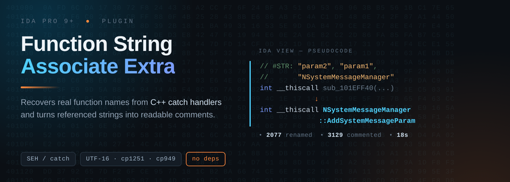

<p align="center">
  
</p>

<p align="center">
  <a href="https://hex-rays.com/ida-pro/"></a>
  <a href="https://www.python.org/"></a>
  
  <a href="LICENSE"></a>
</p>


Open a binary with no symbols and you're looking at a screen full of dummy names. The plugin helps with that in two ways.

First, it scans the strings a function references and puts them into its comment, so you can guess what the function is about before you even open it.

Second — and this is the part I added — in some apps and games (L2 for example) almost every function in the DLL has an error handler that carries the function's own name. The plugin digs those names out of the exception handling data and renames the function accordingly. Makes the research process a hundred times easier.


### What it looks like

Before:

```cpp
int __thiscall sub_101EFF40(void *this, int a2, int a3)
```

After:

```cpp
// #STR: "param2", "NSystemMessageManager::AddSystemMessageParam", "param1"
int __thiscall NSystemMessageManager::AddSystemMessageParam(...)
```

### Install

Copy `FunctionStringAssociateExtra.py` into your IDA plugins directory:

- Windows — `%APPDATA%\Hex-Rays\IDA Pro\plugins`
- Linux / macOS — `~/.idapro/plugins`

Restart IDA. You can also run it without installing via File → Script file...

### Usage

**Edit → Plugins → Function String Associate Extra**, then choose whether to replace existing comments or append to them. Wait for auto-analysis to finish first — the plugin will tell you if it hasn't.

Example output:

```
==============================================================
 Function String Associate Extra ~ summary ~
--------------------------------------------------------------
  Functions total                        17478
  Skipped (< 8 bytes)                     1250
  Already named (rename skipped)          7534
  #STR comments written                   6159
  Names from catch/SEH                    1337
  Rename candidates                       2077
  Renamed                                 2077
  Failed                                     0
  Elapsed                              31.11 s
==============================================================
```

### Configuration

Constants at the top of the file:

| Setting | Default | Meaning |
| --- | --- | --- |
| `MIN_STRING_SIZE` | `4` | Shortest string worth keeping |
| `MAX_LINE_STRING_COUNT` | `10` | Strings per function comment |
| `MAX_COMMENT_SIZE` | `764` | Comment length cap |
| `MIN_FUNC_SIZE` | `8` | Skip thunks smaller than this |
| `ANSI_CODECS` | utf-8, cp1251, cp1252, cp949 | Codecs tried for single-byte strings |
| `UNWIND_HELPERS` | AppUnwindF, ... | Helper names that mark a name-carrying call |
| `SUFFIX_MODE` | `"index"` | `Name_1` / `Name_2`, or `"addr"` for `Name_401000` |
| `CONF_SEH` / `CONF_CALLSITE` / `CONF_STRING` | 100 / 60 / 20 | Confidence per name source |

### Limitations

- The exception-handling walk targets **32-bit MSVC** binaries. On other compilers or on x64 the commenting phase still works, but renaming will find few or no names.
- `UNWIND_HELPERS` is tuned for a particular family of clients. If your target uses a differently named helper, add it there.
- Renaming modifies the database. Work on a copy of your `.idb` the first time.

### Thx to

Sirmabus and oxiKKK for the plugin base <3
